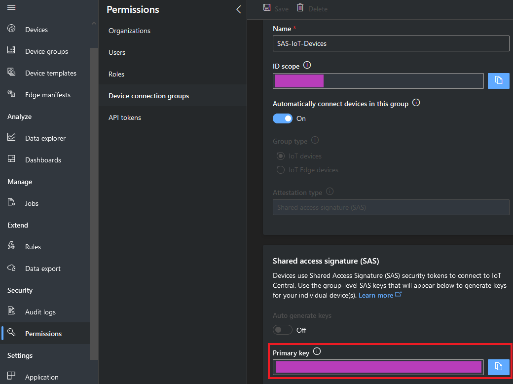

Connect ICS-6280 device to your Azure IoT services
===

<!-- --- -->
# Table of Contents

-   [Introduction](#introduction)
-   [Prerequisites](#prerequisites)
-   [Prepare the Device](#prepare-the-device)
-   [Connect to Azure IoT Central](#connect-to-azure-iot-central)
-   [Additional Links](#additional-links)

<a name="Introduction"></a>

# Introduction 

**About this document**

This document describes how to connect ICS-6280 to Azure IoT Hub using the Azure IoT Explorer with certified device application and device models.

IoT Plug and Play certified device simplifies the process of building devices without custom device code. Using Solution builders can integrated quickly using the certified IoT Plug and Play enabled device based on Azure IoT Central as well as third-party solutions.

This getting started guide provides step by step instruction on getting the device provisioned to Azure IoT Hub using Device Provisioning Service (DPS) and using Azure IoT Explorer to interact with device's capabilities.

ICS-6280 Features:
-   Intel® Elkhart lake SoC Processor, 2~4 cores
-   260-pin DDR4 3200Mhz SO-DIMM with IBECC support x 1
-   10/100/1000 Base-TX Ethernet x 4
-   Supports up to 2 Pairs LAN Bypass (Optional)
-   Support mini-card socket x 1, Micro SIM socket x 1
-   DC 9V~48V power redundancy input with terminal block x 2
-   2.5” SATA SSD x 1 support
-   Support up to RS-232/422/485 COM ports x 2 (COM2 with isolation) with ESD Protection
-   HDMI port x 1, USB 3.2 ports x 2, VGA port x 1
-   Wide-Temp -40°C ~ 75°C Fanless Solution

<div style="page-break-after: always"></div>

<a name="Prerequisites"></a>
# Prerequisites

You should have the following items ready before beginning the process:

**For Azure IoT Central**
-   [Azure Account](https://portal.azure.com)
-   [Azure IoT Central application](https://apps.azureiotcentral.com/)


**For Azure IoT Hub**
-   [Azure IoT Hub Instance](https://docs.microsoft.com/en-us/azure/iot-hub/about-iot-hub)
-   [Azure IoT Hub Device Provisioning Service](https://docs.microsoft.com/en-us/azure/iot-dps/quick-setup-auto-provision)
-   [Azure IoT Public Model Repository](https://docs.microsoft.com/en-us/azure/iot-pnp/concepts-model-repository)

<a name="preparethedevice"></a>
# Prepare the Device.

### Environmental setup

#### Hardware Environment

-	Prepare the following devices :
	1.	ICS-6280
	2.	SATA HDD or SATA SSD
	3.	monitor with I/O: HDMI or VGA
	4.	keyboard and mouse
	5.	RJ-45 Ethernet cable
-	Connect all the above devices to the ICS-6280.
-	Power on ICS-6280.
-	Connect to Network.

#### Software Environment

-	Install Ubuntu 22.04 LTS into ICS-6280.
-	Download the source code from this [Github](https://github.com/aaeonnsd/AzureCertification) and check the [ICS-6280](https://github.com/aaeonnsd/AzureCertification/tree/main/ICS-6280) folder.
-	Install [Python](https://www.python.org/downloads/) and make sure the Python environment is ready ( at least Python 3.7 ).
-	Install [Git](https://git-scm.com/) \
	or type "sudo apt install git" at Terminal.

<div style="page-break-after: always"></div>

#### IOT Hub & DPS configuration
Please refer to this [tutorial](https://docs.microsoft.com/en-us/azure/iot-pnp/set-up-environment) to complete the following procedures :
1.	Use Azure commands or Azure portal to create a Resource Group、an Iot Hub
and a Device Provisioning Service
2.	To link the DPS instance to your IoT hub
3.	To create your device by individual device enrollment in your DPS instance.
4.	Make a note of the DPS information (DPS endpoint/Registration ID/ID
Scope/Symmetric key).
5.	Set the DPS information got from the former step in "test.sh".

```Shell
export IOTHUB_DEVICE_SECURITY_TYPE="DPS"
export IOTHUB_DEVICE_DPS_ID_SCOPE=""
export IOTHUB_DEVICE_DPS_DEVICE_ID=""
export IOTHUB_DEVICE_DPS_DEVICE_KEY=""
export IOTHUB_DEVICE_DPS_ENDPOINT="global.azure-devices-provisioning.net"
export KEYPAD_INTERRUPT="ENABLE"
#If KEYPAD_INTERRUPT set DISABLE, the program will never stop
#If KEYPAD_INTERRUPT set ENABLE, you can stop the program by pressing 'q' key
```

<a name="ConnecttoCentral"></a>
# Connect to Azure IoT Central

1.  Create an application \
Please refer to this [tutorial](https://docs.microsoft.com/en-us/azure/iot-central/core/quick-deploy-iot-central) to create a "Custom application" template.

2.  Create a device template from the device catalog \
Please refer to this [tutorial](https://docs.microsoft.com/en-us/azure/iot-central/core/howto-set-up-template#create-a-device-template-from-the-device-catalog) to create the ICS-6280 device template.

3.  Add a device \
Add a new device under ICS-6280 device template. \
Make a note of the device ID.

4.  Get connection information
- ID scope : In your IoT Central application, navigate to Permissions > Device connection groups. Make a note of the ID scope value.
- Group primary key : In your IoT Central application, navigate to Permissions > Device connection groups > SAS-IoT-Devices. Make a note of the shared access signature Primary key value.

<!-- # hi -->


<!-- <center>


</center> -->

Use the Cloud Shell to generate a device specific key from the group SAS key you just retrieved using the Azure CLI

<div style="page-break-after: always"></div>

```Shell
az extension add --name azure-iot
az iot central device compute-device-key --device-id "sample-device-01" --pk "the group SAS primary key value"
```

Make a note of the generated device key, and the ID scope for this application and set them to "test.sh".

<a name="AdditionalLinks"></a>
# Additional Links

Please refer to the below link for additional information for Plug and Play 

-   [Manage cloud device messaging with Azure-IoT-Explorer](https://github.com/Azure/azure-iot-explorer/releases)
-   [Import the Plug and Play model](https://docs.microsoft.com/en-us/azure/iot-pnp/concepts-model-repository)
-   [Configure to connect to IoT Hub](https://docs.microsoft.com/en-us/azure/iot-pnp/quickstart-connect-device-c)
-   [How to use IoT Explorer to interact with the device ](https://docs.microsoft.com/en-us/azure/iot-pnp/howto-use-iot-explorer#install-azure-iot-explorer)   
